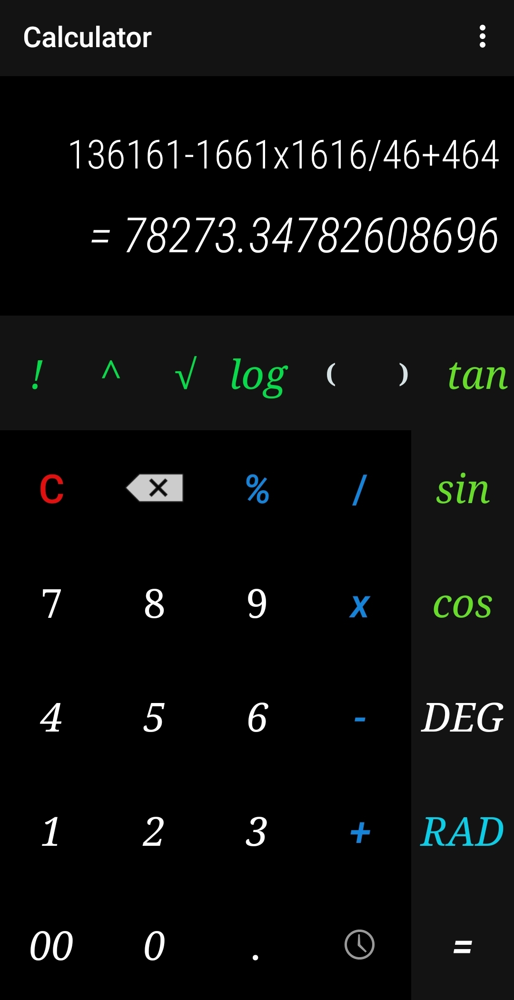
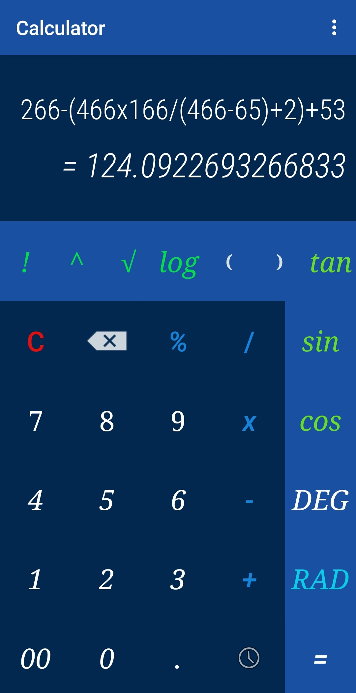
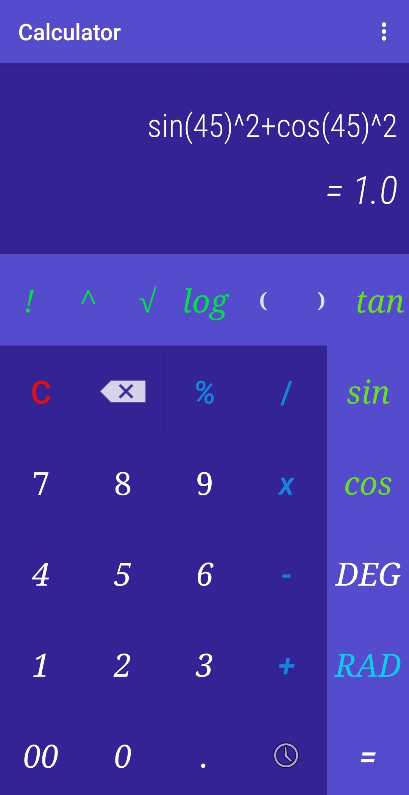
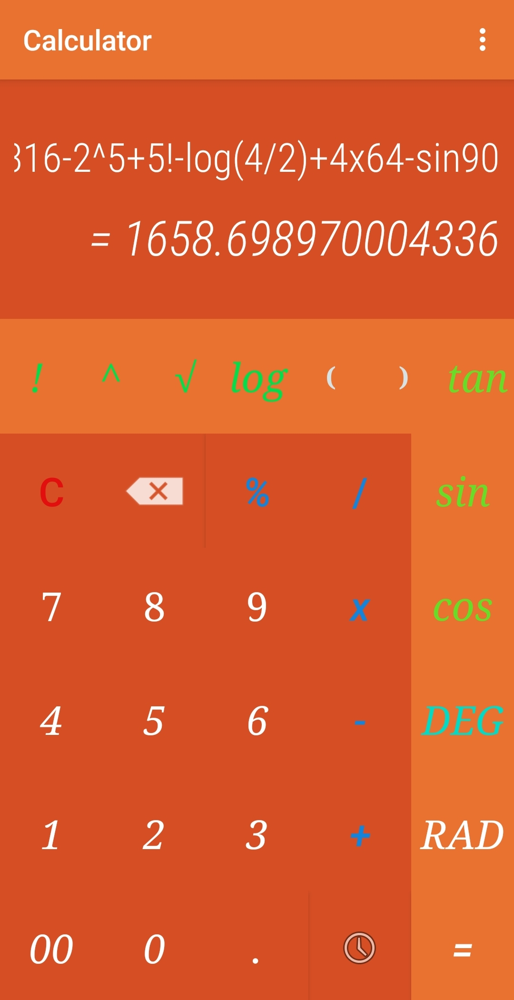
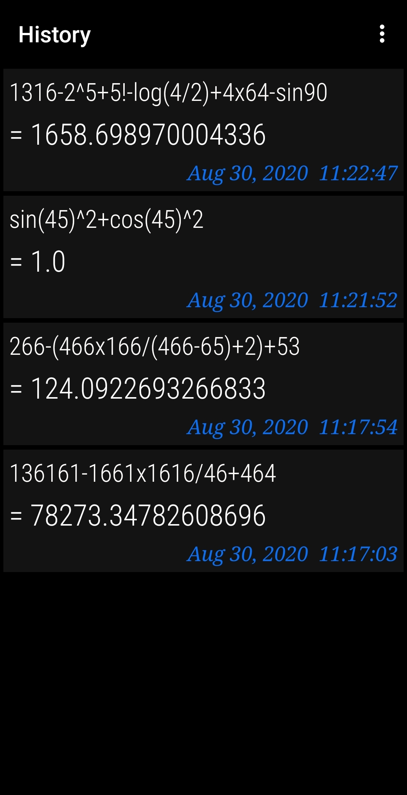
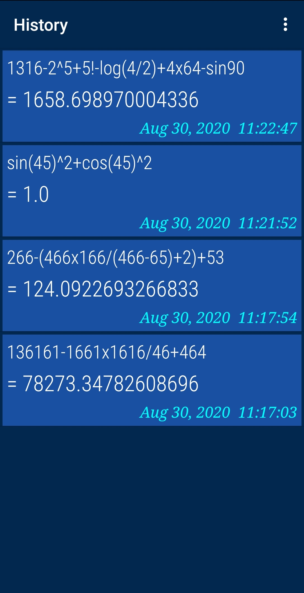
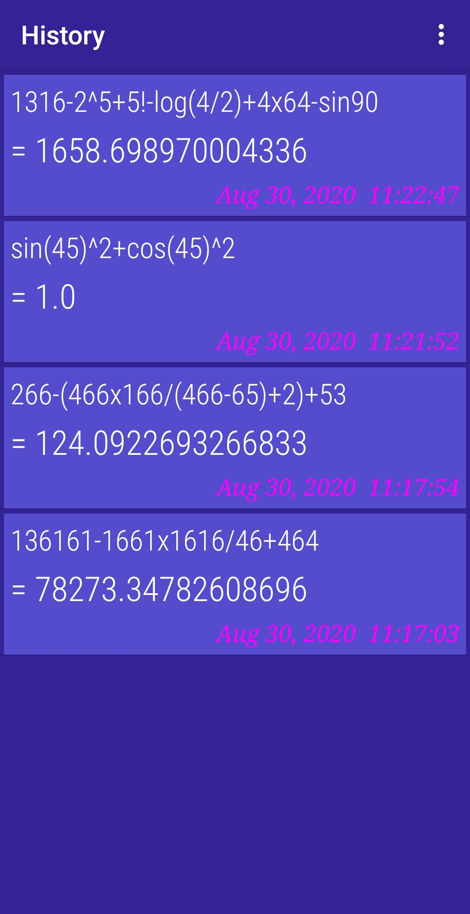
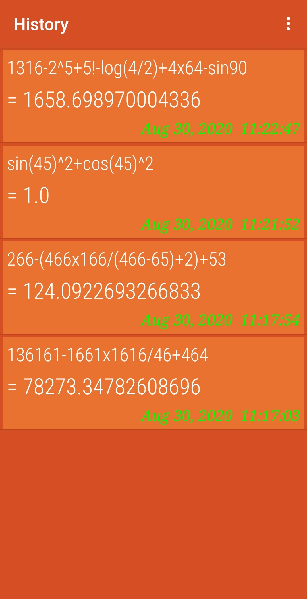

# Overview

This is a advance calculator app.You can simply find factorial, square root, power.It's also support scientific operations such as trigonometric and logarithmic operations. We have also provide history.

You can get this app from playstore using this link.

https://play.google.com/store/apps/details?id=com.yash.advancedcalculator

   

   
